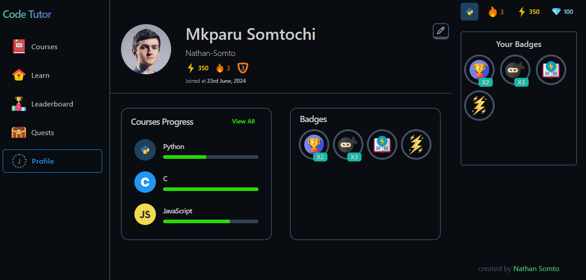
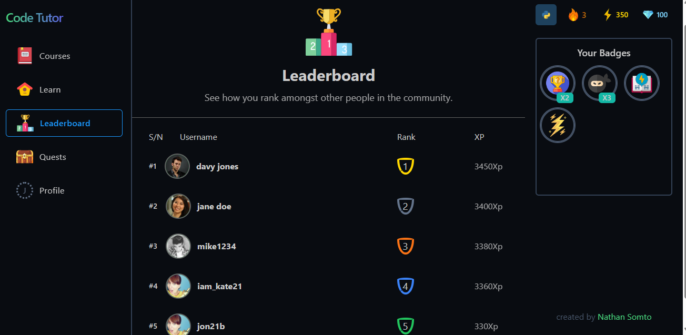
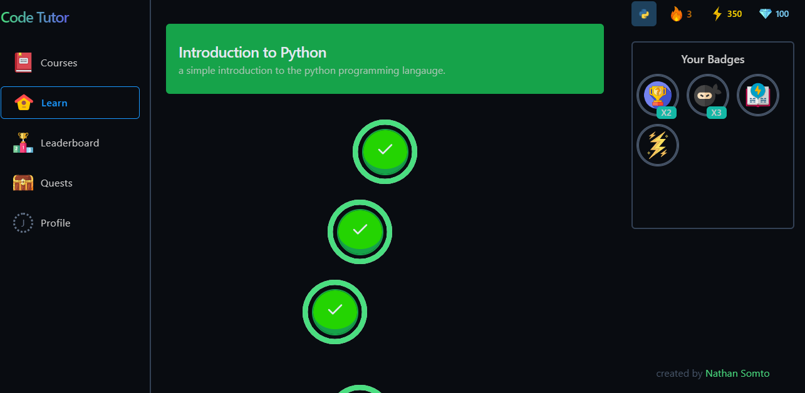
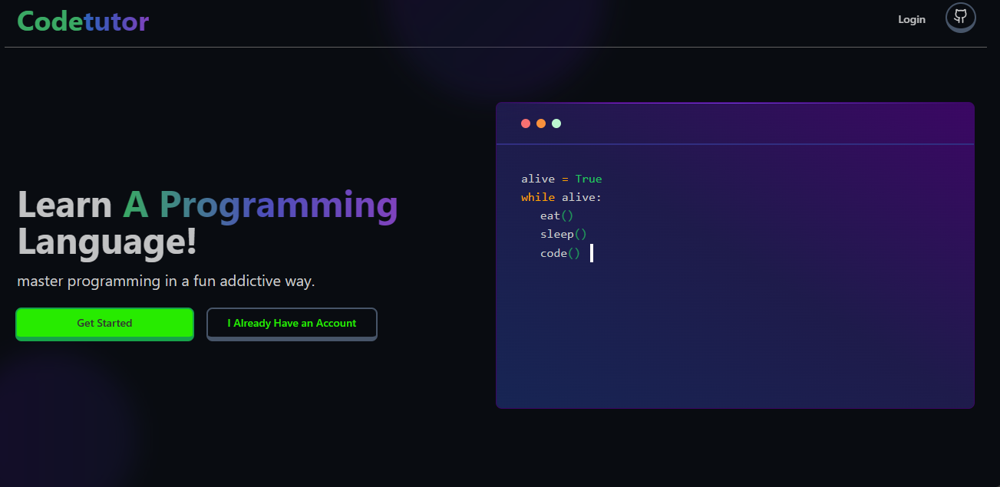

# CODE TUTOR
An Online programming learning platform that infuses gamification as teaching aid.

## FOLDERS
1. Student UI 
    - User interface for student's learning
    - Similar to duolingo
    - React Vite and Shadcn UI project
2. Teacher UI
    - User interface for course management to be controlled by verified instructors or independent contributors
    - Vue Vite and Shadcn UI
3. Code Server
    - Server for handling code execution.
    - Deployed as a docker container.
    - Javascript Node js and Docker
4. Main Server
    - Main application server (authentication, db, students services and teacher services)
    - Express, Typescript, Node js, Prisma, MongoDB and a caching tool yet to decided

### Screenshots
### Student UIs
#### Profile page

#### Leaderboard

#### Learn page

#### Landing Page

#### Deployment
if i can build the code server image and host it, 
then i can deploy the student ui.

the teacher ui and main server are not affected by this problem.

**Note:**  Project still under construction.

**Stats:** will come back to this after my exams.